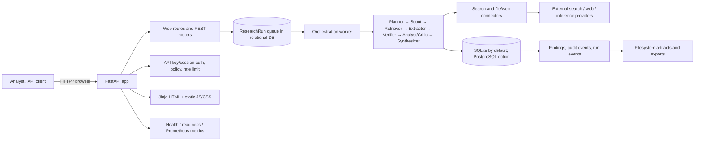
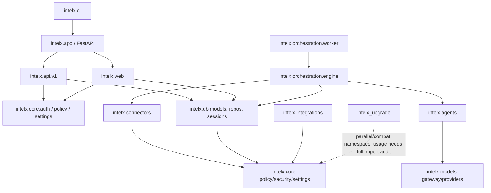
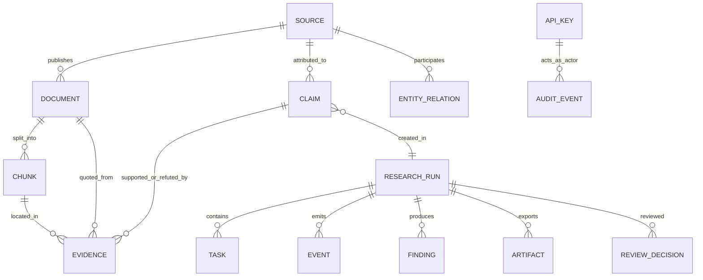

# INTELX Repository Comprehension Report

> **Scope and evidence discipline.** This report analyzes the checked-out files at commit `0921788bfd4c94bb93805493d43df2418495fb06`. Claims are labeled **[FACT]** when directly supported by inspected source/configuration or executed commands, **[INFERENCE]** when derived from cited evidence, and **[HYPOTHESIS]** when requiring additional verification. File citations point to repository paths and line numbers where practical. The checkout is treated as the source of truth; documentation statements are separately identified when they conflict with implementation or execution.

## 0. TL;DR

- **[FACT]** INTELX is a Python 3.11+ modular monolith for evidence-traceable research: it ingests sources, extracts/verifies claims, and synthesizes cited findings (`README.md:3`, `docs/adr/0005-modular-monolith.md:9-16`).
- **[FACT]** The primary runtime is FastAPI + async SQLAlchemy, default SQLite, file-backed raw/artifact storage, with optional PostgreSQL and provider integrations (`pyproject.toml`, `intelx/core/settings.py:46-49`, `docs/adr/0003-sqlite-first-storage.md:9-17`).
- **[FACT]** The evidence lineage is ResearchRun → claims → evidence spans/documents/sources → findings and artifacts (`intelx/db/models.py:53-97,291-388,390-435`).
- **[FACT]** A deterministic mock benchmark of eight tasks passed all stated metrics at 100%; it does not establish live-world quality (`evals/run.py`, `README.md:67-68`; executed result below).
- **[FACT]** Offline tests: 254 passed in 39.79 s; Ruff lint and formatting checks passed (`tests/`, `pyproject.toml`; verification log below).
- **[FACT]** API keys are stored as SHA-256 hashes and support Bearer/X-API-Key; browser sessions can also authenticate API calls (`intelx/core/auth.py:82-94,206-269`).
- **[FACT]** CORS is configured with wildcard origins and credentials together (`intelx/app/factory.py:33-41`); this should be constrained before internet-facing deployment.
- **[INFERENCE]** The largest scaling limit for the documented default topology is SQLite's serialized write behavior plus a polling worker and filesystem artifacts; high write concurrency should move to PostgreSQL and a properly coordinated worker topology (`docs/adr/0003-sqlite-first-storage.md:25-26`, `intelx/orchestration/worker.py:33-57,79-96`).
- **[FACT]** Git history here has one commit, one author, no tags, so project evolution/churn/bus factor cannot be inferred from this checkout (`git log`, `git shortlog`, `git tag`).
- **[FACT]** Important confidence boundary: this is a single-commit snapshot; many >500-line files were sampled rather than read line-by-line. See Coverage & Self-Assessment.

## 1. Executive Summary

**[FACT]** INTELX presents itself as an evidence-driven intelligence research platform. The implemented product is a Python service with REST/web ingress, an asynchronous orchestration worker, agent modules for planning/retrieval/extraction/verification/synthesis, relational persistence, a server-rendered workspace, and command-line operations (`intelx/app/factory.py:21-55`, `intelx/orchestration/worker.py:20-120`, `intelx/db/models.py`, `intelx/web/routes.py`, `intelx/cli/main.py`). **[FACT]** Its distinguishing data model makes evidence auditable by storing claim text and source-backed quotes with exact start/end offsets, then recording findings and export artifacts (`intelx/db/models.py:291-388,390-435`; evidence migration `intelx/db/migrations/versions/0002_evidence_data_model.py`).

**[INFERENCE]** The architecture favors one deployable application and shared relational transactions over service decomposition; ADR 0005 explicitly describes typed in-process calls and shared DB state (`docs/adr/0005-modular-monolith.md:9-22`). SQLite-first operation lowers local/air-gapped setup burden but constrains multi-writer throughput. The code includes a PostgreSQL driver and production compose topology, which is an intended scale-up path—not proof of successful production scaling (`pyproject.toml`; `docs/adr/0003-sqlite-first-storage.md:17-26`; `docker-compose.production.yml`).

**Health assessment — [INFERENCE]:** promising product framing and a meaningful offline test/evaluation baseline, with broad modularity and explicit security controls such as SSRF checks, role guards, and audit hashing. Primary concerns are deployment hardening (permissive CORS), sprawling integration surface, absent dependency lock/audit evidence, single-tenant data model, SQLite throughput, and weak historical evidence due to a one-commit checkout. The test suite passed offline but live-provider and deployed-topology behavior were not verified.

## 2. Fact Sheet

| Field | Assessment |
|---|---|
| Name | **[FACT]** INTELX (`pyproject.toml`, `intelx/core/version.py`) |
| Purpose | **[FACT]** Evidence-driven research/intelligence workflow with citations and provenance (`README.md:3`) |
| Primary language | **[FACT]** Python: 205 `.py` files; repo totals 303 files and 40,222 lines across file types (counted with `find`/`wc`) |
| Frameworks | **[FACT]** FastAPI, SQLAlchemy 2 async, Pydantic Settings, Jinja2 (`pyproject.toml`) |
| License | **[FACT]** No root `LICENSE` file found in the enumerated tree; licensing status unresolved |
| Repo size | **[FACT]** 303 files, 40,222 newline-counted lines; includes fixtures/docs/generated-looking JSON, not pure LOC |
| Age/activity | **[FACT]** Available git history: one commit dated 2026-10-07, one author, zero tags. **[INFERENCE]** No age/activity trend can be responsibly assessed from the shallow snapshot |
| Test posture | **[FACT]** 254 tests passed when excluding live test; eight-task eval passed; CI excludes `tests/test_live.py` (`.github/workflows/ci.yml`) |
| Deployment | **[FACT]** Docker single-container and production compose files, Render manifest, Nginx config (`Dockerfile`, `docker-compose*.yml`, `render.yaml`, `deploy/nginx/nginx.conf`) |
| Overall grade | **[INFERENCE]** B-/C+ for an early-stage codebase: good offline verification and clear domain model; production security/scalability and reproducibility need work. Not a formal external audit grade |

## 3. Architecture

### System topology

**[FACT]** App factory installs middleware/error handlers/static files and includes API and web routers (`intelx/app/factory.py:21-55`). **[FACT]** Runtime startup creates schema/FTS tables, seeds API keys, and optionally starts an embedded worker and background loops (`intelx/app/lifespan.py:93-192`). **[FACT]** The worker claims a queued run, commits the claim, then executes it in a separate transaction (`intelx/orchestration/worker.py:33-77`). **[INFERENCE]** The embedded worker and dedicated worker are alternative process placements for the same orchestration code; running both without correct claim semantics would risk duplicate work, though `RunRepo.claim_next_queued_run` is intended to make claiming atomic.

### Module dependency map

**[FACT]** Runtime paths import the core settings/auth, DB, agent, connector, and model packages through `intelx` modules (`intelx/app/lifespan.py`, `intelx/api/v1/endpoints.py`, `intelx/orchestration/engine.py`). **[HYPOTHESIS]** `intelx_upgrade` is a staged refactor or compatibility experiment; verify with a complete import/call-site graph before deleting or merging it. `tests/upgrade/` contains several very short tests, but its production adoption level was not established.

### Data model (ER-style)

**[FACT]** Entities in this simplified graph are SQLAlchemy models, not all relationships are declared as ORM foreign-key relationships; source model fields should be read before relying on the diagram (`intelx/db/models.py:53-523`). Core provenance: `ResearchRun`, `Source`, `Document`, `Chunk`, `Claim`, `Evidence`, `Finding`, `Artifact`; governance/ops: `Event`, `AuditEvent`, `ReviewDecision`, `Policy`, `ApiKey`; entity-resolution models: `Entity`, `EntityAlias`, `EntityRelation`, `EntityMerge` (`intelx/db/models.py:53-523`).

## 4. How It Runs

### Entry points and startup

| Entry | Behavior |
|---|---|
| ASGI app | **[FACT]** `intelx.app.main:app`; calls `create_app()`; direct module execution uses Uvicorn host `0.0.0.0:8000` (`intelx/app/main.py:1-10`) |
| CLI | **[FACT]** `intelx` maps to `intelx.cli.main:main` (`pyproject.toml`; commands implemented in `intelx/cli/main.py`) |
| Worker | **[FACT]** `intelx worker` invokes async worker loop; SIGINT/SIGTERM stop handler (`intelx/orchestration/worker.py:79-124`) |
| Eval | **[FACT]** `python -m evals.run` runs eight fixtures (`evals/run.py`; `evals/golden/`) |
| Background loops | **[FACT]** Optional news ingestion and autonomous research loops start through FastAPI lifespan toggles (`intelx/app/lifespan.py:59-90,168-192`) |

Startup order **[FACT]**: `create_app` configures routes/middleware/errors (`intelx/app/factory.py:21-55`) → lifespan resolves settings and logging → creates local data directories → connects engine and creates metadata/SQLite FTS/triggers → seeds configured API keys → optional demo seed → starts worker (default enabled outside production) and explicitly enabled background loops (`intelx/app/lifespan.py:93-192`). **[FACT]** Shutdown stops hooks and disposes the engine in the remainder of lifespan (`intelx/app/lifespan.py:168-192`). **[INFERENCE]** A schema/DB failure during startup prevents ASGI lifespan startup and therefore serves no requests; the failure will propagate through Uvicorn startup, rather than being converted into an ordinary API response.

### Configuration inventory (grouped; exact fields/defaults in `intelx/core/settings.py`)

All settings use Pydantic `BaseSettings`, `.env`, `INTELX_` prefix, case-insensitive names, and `extra="ignore"` (`intelx/core/settings.py:29-38`). Alias lists allow legacy/plain names; secrets below are sensitive unless noted.

| Variables | Purpose / observed default | Required? / where |
|---|---|---|
| `INTELX_ENV` / `ENVIRONMENT` / `ENV` | `development` | Optional; settings `:41-45` |
| `INTELX_DB_URL` / `DATABASE_URL` / `DB_URL` | `sqlite+aiosqlite:///./data/intelx.db` | Optional; `:46-49` |
| `TURSO_DATABASE_URL`, `TURSO_AUTH_TOKEN` | URL has a configured hosted Turso default; token none | Optional settings; inspect usage before enabling; `:51-59` |
| `INTELX_SECRET_KEY` (field `SECRET_KEY`) | `None`; signing/crypto | Production validation may require strong value; secret; `:61-64,516+` |
| `DATA_DIR` | `./data` | Optional; `:65-68` |
| `MOCK_MODE` | `True` | Optional; `:71-75` |
| `LLM_PROVIDER`, `LLM_BASE_URL`, `LLM_API_KEY`, `OPENAI_API_KEY`, `ANTHROPIC_API_KEY`, `LLM_MODEL`, `ALLOW_MOCK_FALLBACK` | provider `inference`, model `mock-gpt-4o`, fallback false; credentials none | Provider credential depends on selected provider; secrets in keys; `:76-124` |
| `INFERENCE_URL`, `INFERENCE_API_KEY` | Hosted URL default, key none | Key required by actual live service; secret; `:126-145` |
| `MEMORA_URL/API_KEY`, `FUTURIS_BASE_URL/API_KEY/WEBHOOK_URL`, `STRATEX_BASE_URL/API_KEY/WEBHOOK_URL` | Integration endpoints and tokens | Optional per integration; secrets; `:174-218` |
| `LLM_MODEL_PLANNER/EXTRACTOR/VERIFIER/ANALYST/SYNTHESIZER/CRITIC` | role-specific model override, `None` | Optional; `:220-245` |
| `TAVILY_API_KEY` | `None` | Optional; secret; `:251-256` |
| `MAX_RUN_USD=2`, `MAX_RUN_MINUTES=15`, `MAX_TOOL_CALLS=60`, `MAX_SOURCES_PER_RUN=25` | run resource ceilings | Optional; `:258-274` |
| `RESPECT_ROBOTS=True`, `USER_AGENT` | crawl identity/policy | Optional; `:276-284` |
| `DOMAIN_ALLOWLIST=[]`, `DOMAIN_DENYLIST=[]` | domain policy | Optional; `:285-292` |
| `FETCH_TIMEOUT_S=20`, `MAX_PAGE_BYTES=2,000,000`, `PER_DOMAIN_DELAY_S=1`, `MAX_CONCURRENT_FETCHES=4` | fetch limits | Optional; `:293-308` |
| `ENABLE_DEMO_SEEDER=False`, `RUN_EMBEDDED_WORKER=None`, `ENABLE_NEWS_INGESTER=False`, `ENABLE_AUTONOMOUS_RESEARCH=False` | background/fixture startup toggles | Optional; embedded worker defaults to non-production enabled; `:309-324`, lifespan `:168-192` |
| `SESSION_TTL_SECONDS=28800`, `INTELX_API_KEY=""`, `API_KEYS=[]`, `FRIDAY_API_KEY=None` | web/API auth | API keys needed for authenticated operations; secrets; `:326-344` |
| `MAX_CONCURRENT_RUNS=5`, `REDIS_URL=None` | concurrency / queue config | Optional; Redis usage must be verified; `:345-355` |
| Retention variables | raw docs 30 days, reports and raw retention fields continue through settings end | Optional; `intelx/core/settings.py:356-` |

**[FACT]** There are also process CLI flags/options in `intelx/cli/main.py` (sampled rather than transcribed exhaustively); Uvicorn options are in `Makefile` and `intelx/app/main.py`. **[FACT]** The README's `dev-admin-key` and `dev-member-key` are documentation defaults, not production credentials; seed flow is in `intelx/core/auth.py` and `intelx/app/lifespan.py`.

### Environments

**[FACT]** Development defaults to mock mode and SQLite. README says Docker Compose is production mode and requires service secrets/provider credentials (`README.md:29-44`). **[FACT]** Separate production compose defines API/worker/PostgreSQL/Redis services (`docker-compose.production.yml`); `render.yaml` is another deployment manifest. **[INFERENCE]** The configurations represent more than one topology, and their actual health under a cloud platform was not exercised.

## 5. Deep Dives

### Stack and dependencies

| Dependency | Constraint in `pyproject.toml` | Purpose / criticality |
|---|---|---|
| FastAPI `>=0.115.0`, Uvicorn `>=0.30.0` | floating lower bounds | HTTP app/server; critical |
| Pydantic `>=2.8.0`, pydantic-settings `>=2.7.0` | floating | request/config validation; critical |
| SQLAlchemy asyncio `>=2.0.30`, aiosqlite `>=0.20.0`, asyncpg `>=0.29.0`, Alembic `>=1.13.0` | floating | relational persistence/migrations; critical |
| httpx `>=0.27.0`, BeautifulSoup4 `>=4.12.0`, pypdf `>=5.0.0`, python-docx `>=1.1.0`, python-multipart `>=0.0.12` | floating | network retrieval and file parsing; critical to ingestion |
| Jinja2 `>=3.1.0`, Prometheus client `>=0.20.0` | floating | web HTML and metrics; product-supporting |
| libsql-client `>=0.3.1` | floating | declared Turso client; actual critical call sites not fully verified |
| Optional OpenAI `>=1.30,<2`, Anthropic `>=0.30,<1` | bounded major range | optional LLM providers |
| Dev pytest `>=8.2`, pytest-asyncio `>=0.23`, Ruff `>=0.5`, respx `>=0.21` | floating | testing/lint/mock HTTP |

**[FACT]** `requirements.txt` duplicates most base requirements but adds `python-dotenv`; no lockfile, `constraints.txt`, runtime pin file, or `engines` equivalent was found. **[INFERENCE]** Fresh installation is not byte-for-byte reproducible because transitive and direct versions float. CI uses Python 3.11 (`.github/workflows/ci.yml`). Scripts in `Makefile` are read; no claim is made that every `scripts/*.py` helper is production runtime code.

### Core flows (selection rationale)

**[INFERENCE]** The three flows below are selected because they form the product promise stated in README and traverse the central API→orchestration→evidence→report path (`README.md:3`, `intelx/api/v1/endpoints.py`, `intelx/orchestration/engine.py`).

#### A. Submit and execute a research run

1. **[FACT] Entry:** `POST /research/jobs` handler `create_research_job` (`intelx/api/v1/endpoints.py:142-225`); request models include objective, scope, budget (`:57-90`).
2. **[FACT] Validation/auth:** Pydantic request model validates shape; endpoint requires authenticated API key; role and limits/ownership checks are in endpoint helpers (`intelx/api/v1/endpoints.py:130-148`).
3. **[FACT] Rules/side effects:** Run is created in relational DB, with idempotency support on `ResearchRun.idempotency_key` (`intelx/db/models.py:53-88`); API returns job/run identifiers. Worker claim is committed separately, then orchestration executes and commits (`intelx/orchestration/worker.py:37-77`).
4. **[FACT] Business stages:** Orchestration engine and typed agent modules provide planner/scout/retrieval/extraction/verification/analysis/criticism/synthesis (`intelx/orchestration/engine.py`; `intelx/agents/`). **[FACT]** Evidence stores quote and offset plus source/document/chunk/run references (`intelx/db/models.py:351-385`).
5. **[FACT] Errors:** Worker catches run exceptions, rolls back, attempts to mark run FAILED with error type/message (`intelx/orchestration/worker.py:58-76`); if even that update fails it logs the failure. API exception handlers are registered in factory (`intelx/app/factory.py:43-45`).
6. **[FACT] End:** Findings and artifact records are stored; clients can retrieve job/report/artifact/event data (`intelx/api/v1/endpoints.py:268-425`, `intelx/db/models.py:390-453`).

#### B. Web fetch and evidence capture

1. **[FACT] Entry:** Retrieval agent delegates source access to connector modules (`intelx/agents/retriever.py`; `intelx/connectors/`).
2. **[FACT] Trust checks:** `safe_target` restricts schemes to HTTP(S), rejects embedded user information, checks policy, resolves DNS and rejects non-global/reserved addresses (`intelx/connectors/fetch_guard.py:37-91`). The web connector validates DNS and pins the first validated resolved IP while preserving host/SNI (`intelx/connectors/web.py:137-200`).
3. **[FACT] Crawl handling:** Robots rules are cached for an hour when fetched; exceptions fall back to allow-all (`intelx/connectors/web.py:211-238`). Fetch limits and per-domain throttling are controlled by settings (`intelx/core/settings.py:276-308`).
4. **[FACT] Side effects:** Retrieved content is normalized, persisted as source/document/chunks and attached evidence through repositories (`intelx/connectors/`, `intelx/memory/normalize.py`, `intelx/db/repos.py`). **[INFERENCE]** Exact behavior depends on connector and provider path; not every provider was exhaustively line-traced.
5. **[FACT] Risk:** The address-pinning design mitigates DNS rebinding, but proxy trust is explicitly acknowledged as residual in `docs/threat-model.md:107-111`; robots fetch errors fail open.

#### C. Governance: review/trust/retraction/audit

1. **[FACT] Entry:** Review, source trust, claim retraction, policy and audit endpoints are in `intelx/api/v1/endpoints.py:466-660`.
2. **[FACT] Authorization:** Admin actions use admin guard/helpers, including role dependency patterns in auth (`intelx/core/auth.py:350-364`) and endpoint-level `_is_admin` (`intelx/api/v1/endpoints.py:130-140`).
3. **[FACT] State effects:** Claim status/retraction fields, source trust, policy versions, review decisions and append-only audit rows are modeled (`intelx/db/models.py:291-349,456-505`). Audit records use previous/current SHA-256 fields and have a verification endpoint (`intelx/db/models.py:456-470`, `intelx/api/v1/endpoints.py:616-659`; implementation in `intelx/db/repos.py`).
4. **[INFERENCE]** Audit-chain hashes make tampering detectable only if the chain's trusted terminal value/storage is protected; a database administrator able to rewrite all rows can recompute an unkeyed hash chain. Remediation: anchor signed checkpoints outside the DB.

### Invariants and concurrency

| Invariant | Evidence / possible violation |
|---|---|
| Evidence quote should match document span | Documented `README.md:91-95`; fields in `intelx/db/models.py:369-371`. Runtime enforcement/test locations include verifier and test suites; a DB-level check was not proven by schema inspection |
| Reports cite resolvable entities and grounded claims | `intelx/agents/synthesizer.py`, report gate and tests (`tests/test_adversarial.py`, `tests/test_agents.py`); can regress in synthesis or alternate report paths |
| A claimed run should be executed once | Repository claim method and worker transaction boundaries (`intelx/db/repos.py`; `intelx/orchestration/worker.py:33-57`); test concurrent worker behavior (`tests/test_concurrent_runs.py`) |
| API key secrets are not stored raw | Key hash (`intelx/core/auth.py:82-94`) and model `key_hash` (`intelx/db/models.py:507-523`); compromised config/logging remains a boundary |
| Single-tenant deployment data stays within one organization | ADR 0004 (`docs/adr/0004-single-tenant-now.md:9-24`); no tenant_id partition fields in principal provenance model inspected |

**[FACT]** Worker and ASGI code use asyncio. The claim/execute split leaves an interval where run status is claimed before full work commits; failure recovery paths must be tested for process death in that interval (`intelx/orchestration/worker.py:41-76`). SQLite uses WAL/busy timeout by documented ADR (`docs/adr/0003-sqlite-first-storage.md:9-15`). **[HYPOTHESIS]** The local `asyncio.Semaphore` and domain delay enforce per-process limits only; multiple API/worker replicas may exceed aggregate limits unless shared queue/rate coordination is active.

### API and interface inventory

**[FACT]** Main REST operations (authenticated unless explicitly health/version) are registered in `intelx/api/v1/endpoints.py`; route strings and request models are authoritative there. The table groups aliases to keep it readable.

| Method / path | Auth | Handler and purpose |
|---|---|---|
| POST `/research/jobs` | API key | `create_research_job`, create/queue run (`endpoints.py:142-225`) |
| GET `/research/jobs` | API key | list runs (`:226-267`) |
| GET `/research/jobs/{job_id}` | API key + access check | job detail (`:268-296`) |
| POST `/research/jobs/{job_id}/cancel`; DELETE same; DELETE `/runs/{job_id}` | API key + access check | cancel aliases (`:297-325`) |
| GET `/research/jobs/{job_id}/events` | API key | poll/stream run events (`:326-364`) |
| GET `/research/jobs/{job_id}/artifacts` | API key | list artifacts (`:365-393`) |
| GET `/artifacts/{artifact_id}` | API key or session cookie | artifact download (`:394-424`) |
| POST `/research/jobs/{job_id}/followup` | API key | follow-up run (`:425-465`) |
| POST `/research/jobs/{job_id}/review` | API key/admin rules | human review (`:466-506`) |
| POST `/knowledge/query` | API key | FTS/knowledge query (`:507-521`) |
| GET `/sources/{source_id}` | API key | source metadata (`:522-544`) |
| POST `/sources/{source_id}/trust` | Admin | change trust (`:545-565`) |
| POST `/knowledge/claims/{claim_id}/retract` | Admin | retract claim (`:566-594`) |
| GET/PUT `/policies` | Admin | get/update policy (`:595-615`) |
| GET `/audit`; GET `/audit/verify` | Admin | audit list/verification (`:616-659`) |
| POST `/admin/retention/purge` | Admin | retention cleanup (`:660+`) |
| GET/HEAD `/healthz`, `/health`; GET/HEAD `/readyz`; GET `/metrics` | No auth apparent in handlers | liveness/readiness/Prometheus (`intelx/api/v1/health.py:17-105`) |
| GET `/version` | No auth apparent | version metadata (`intelx/api/v1/version.py:13-23`) |
| Friday delegation/status/findings/report/events/contradictions/cancel routes | dedicated key/auth | `intelx/api/v1/friday.py:362-1130` (large file sampled) |
| Friday-universe intelligence/status/trigger endpoints | route-specific | `intelx/api/v1/friday_universe.py:50-266` |
| Futuris context/update/combined/query | API key | `intelx/api/v1/futuris.py:62-239` |
| Stratex market research/signal | route-specific | `intelx/api/v1/stratex.py:84-314` |
| Subscription create/read/pause/resume | route-specific | `intelx/api/v1/subscriptions.py:44-131` |

**[FACT]** `intelx/api/router.py` composes routers; exact prefix composition must be read when building client URLs (`intelx/api/router.py`). **[FACT]** Auth supports Bearer and `X-API-Key`; sliding-window limiter says 120 req/min (`intelx/core/auth.py:206-249`). **[FACT]** Per-run access helper exists (`intelx/api/v1/endpoints.py:135-140`). **[FACT]** API versioning appears as a v1 package, but a stable versioning/deprecation policy was not established. **[FACT]** CORS is permissive; no global rate limit distribution evidence. Error handlers are registered in `intelx/app/factory.py:43-45` and implemented in `intelx/core/errors.py`.

### Frontend

**[FACT]** Browser UI uses Jinja templates (`intelx/web/templates/`), route handlers (`intelx/web/routes.py`), and vanilla static JS/CSS (`intelx/web/static/app.js`, `style.css`); no React/Vue build pipeline or client package manifest was found. **[FACT]** Session auth is cookie-based and API auth can accept the cookie fallback (`intelx/web/auth.py`, `intelx/core/auth.py:226-234`). **[INFERENCE]** SSR reduces client state complexity, but accessibility/i18n quality was not formally evaluated; no dedicated automated browser test framework is declared.

## 6. Quality

**[FACT]** CI uses Python 3.11, installs editable `.[dev]`, runs Ruff lint and format check, and runs pytest excluding `tests/test_live.py` (`.github/workflows/ci.yml:1-32`). `Makefile` provides `setup`, `migrate`, `seed-demo`, `dev`, `test`, `eval`, `lint`, `format`, and ops commands. No coverage gate, static type checker, or release automation was found in inspected CI.

**Representative tests read/sample assessed:**

| Test | Assessment |
|---|---|
| `tests/test_connector_fetch_guard.py` | **[FACT]** Exercises blocked/allowed target validation and important SSRF boundaries; behavior-oriented |
| `tests/test_concurrent_runs.py` | **[FACT]** Exercises concurrent job processing/claim behavior; high-value due to persistence race surface |
| `tests/test_adversarial.py` | **[FACT]** Tests prompt injection/redaction and trust controls; includes only synthetic key-like strings |
| `tests/test_api.py` | **[FACT]** Integration-style API coverage using fixtures; substantial but not proof every alternate router is covered |
| `tests/test_release_writer_lock_lifecycle.py` | **[FACT]** Addresses concurrency lifecycle explicitly; representative of newer regression tests |

**[FACT]** Offline suite has 254 passing tests; live-provider test is excluded by CI and by this report's invocation. Test suite breadth is substantial by file count, but the `tests/upgrade/` modules include terse tests that may offer less behavioral assurance (`tests/upgrade/`). **[INFERENCE]** High-risk gaps to focus on are production config, CORS/browser CSRF behavior, multi-replica queue claims, provider outage/retry behavior, and deployed DB migrations; lack of coverage measurement prevents a numeric coverage percentage.

**Fresh-machine experience — [FACT]** `pip install -e '.[dev]'` succeeds in a venv and the repo's test/lint/eval commands work. The base system had PEP 668 and no pytest, so direct system install failed; the project instructions do not specify a lock or a venv manager. Docker was not run.

## 7. Security Ledger

| Finding | Severity | Evidence | Exploitability reasoning | Concrete remediation |
|---|---|---|---|---|
| Wildcard CORS origins combined with credentials | **High** | `intelx/app/factory.py:35-41` | Browsers disallow wildcard+credentials in standard CORS semantics, but the configuration is unsafe/ambiguous and encourages credentialed cross-origin surface; verify actual middleware behavior with browser tests. | Explicit trusted origin list; disable credentials where unnecessary; add regression tests |
| Session cookie flags / CSRF defense need deployment verification | **Medium** | `intelx/web/auth.py`; `intelx/web/routes.py:72-120`; cookie auth fallback `intelx/core/auth.py:226-234` | Cookie-authenticated state changes may be exposed to CSRF if SameSite/secure/CSRF token protections are insufficient. | Inspect cookie options; enforce Secure/HttpOnly/SameSite; CSRF token/origin checks on mutations |
| Single-tenant model cannot safely host separate customer tenants as-is | **High** for SaaS | `docs/adr/0004-single-tenant-now.md:9-24`; no tenant partition field in main entities (`intelx/db/models.py`) | Shared DB plus authorization based on one organization can permit cross-customer exposure if marketed/deployed as multi-tenant. | Do not offer shared SaaS until tenant ownership is end-to-end, RLS/tenant tests exist |
| In-memory rate limiting is per-process | **Medium** | `intelx/core/auth.py:110-139,242-249` | Multiple replicas get independent budgets; attackers can multiply throughput. | Shared Redis-backed limiter; document trust proxy/IP semantics |
| Robots.txt failure is allow-all | **Medium** | `intelx/connectors/web.py:211-238` | Network or parsing failures bypass crawler disallow rules. | Fail closed or define documented conservative failure policy; observability/allow override |
| Unkeyed hash chain can be recomputed by DB writer | **Medium** | `intelx/db/models.py:456-470`; `intelx/db/repos.py` audit implementation | Detects accidental mutation but does not prevent a privileged actor from rewriting ledger and hashes. | External signed checkpoints/keyed HMAC, immutable/WORM export, independent verifier |
| Network fetch is a sensitive SSRF boundary, mitigated but complex | **Low residual / High impact if bypassed** | `intelx/connectors/fetch_guard.py:37-91`; `intelx/connectors/web.py:137-200`; `docs/threat-model.md:107-111` | Code validates resolved addresses and pins first address; proxy behavior remains trusted, and all redirects/hops require assurance. | Continue adversarial tests for redirects, IPv6, proxies, DNS changes; egress firewall |
| Floating dependency versions and no lock | **Medium** | `pyproject.toml`, `requirements.txt` | Unreviewed upstream releases can alter runtime or introduce vulnerabilities; no reproducible dependency audit baseline. | Generate lock/constraints; Dependabot/renovate and pip-audit CI |
| No actual committed secret found in narrow grep | **Informational** | Scan output only matched fake test tokens `tests/test_adversarial.py:73,89,100,117-119`; `.gitignore` excludes `.env` | Narrow regex is not secret scanning and tests intentionally include fake credentials. | Run dedicated secret scanner against full history before deployment |
| Public metrics/health surface | **Low/Medium** | `intelx/api/v1/health.py:17-105` | Metrics may disclose operational metadata; endpoint exposure depends ingress. | Restrict metrics at network layer; review labels for sensitive dimensions |
| API key hashing uses SHA-256 digest | **Low residual** | `intelx/core/auth.py:82-94` | High-entropy random API keys resist offline guessing, but SHA-256 is not a password KDF if users can choose low-entropy secrets. | Ensure generated entropy/length; use keyed HMAC or slow hash if arbitrary human keys are supported |

**[FACT]** `docs/threat-model.md` and `AUDIT_REPORT.md` describe mitigations; a documentation claim about controls is not treated as independent validation. No full dependency vulnerability scanner was run. No dedicated comprehensive secret scanner was run.

## 8. Performance & Scalability

**[FACT]** Likely hot paths are per-run retrieval, document normalization/chunking, model calls, evidence persistence, and event polling (`intelx/orchestration/engine.py`, `intelx/agents/retriever.py`, `intelx/memory/normalize.py`, `intelx/api/v1/endpoints.py:326-364`). Fetch concurrency defaults to four; per-domain delay one second; page max two MB (`intelx/core/settings.py:293-308`). **[FACT]** SQLite-first ADR acknowledges parallel write limits and points high throughput to PostgreSQL (`docs/adr/0003-sqlite-first-storage.md:25-26`).

**10× load answer — [INFERENCE]:** Under 10× simultaneous runs, the first likely bottleneck is the shared DB write path and worker capacity (default `MAX_CONCURRENT_RUNS=5`, default embedded worker, one job loop with sequential `run_once`) before read APIs; then external inference/search quotas and per-domain crawl delays. If the deployment uses multiple API replicas with a separate worker, SQLite lock contention and local in-memory limiter fragmentation become more acute. This ordering is a reasoned expectation, not a benchmark result.

| Quick win | Evidence / effect |
|---|---|
| Set explicit production CORS allowlist | Removes avoidable cross-origin misconfiguration (`intelx/app/factory.py:35-41`) |
| Add shared rate limiter and queue coordination before replicas | Current limiter lives in process (`intelx/core/auth.py:110-139`); `REDIS_URL` exists but active usage was not proven (`intelx/core/settings.py:351-355`) |
| Instrument per-stage latency, provider retries, DB lock waits | Metrics endpoint exists (`intelx/api/v1/health.py:101-105`), but comprehensive tracing was not confirmed |
| Ensure pagination/limits on every list/query endpoint | Endpoint list has pagination on some routes; audit each query in `intelx/api/v1/endpoints.py` and `intelx/db/repos.py` |
| Pin dependency set and benchmark live tasks separately | No lock; mock eval latency is 0.12s and does not represent external calls (README `:67-71`) |

## 9. Operations & Infrastructure

**[FACT]** Infrastructure includes `Dockerfile`, `docker-compose.yml`, `docker-compose.production.yml`, `render.yaml`, and Nginx config (`deploy/nginx/nginx.conf`). The README documents a local compose setup and a separate PostgreSQL/Redis deployment (`README.md:29-44`). **[FACT]** Data/artifacts persist under `data/`; `.gitignore` excludes runtime raw data and DB files (`.gitignore`). **[FACT]** Health, readiness, and metrics endpoints exist (`intelx/api/v1/health.py:17-105`).

**[INFERENCE]** Logs and Prometheus metrics are present, but no evidence of distributed tracing, alert definitions, SLOs, or centralized log backend was found in the inspected manifests. Secret delivery appears environment-based; no Vault/KMS integration was established. **[FACT]** README states production compose rejects mock provider and requires credentials, but this was not exercised (`README.md:31-44`). Resource requests/limits and autoscaling should be checked in deployment configs before cost/operational approval.

## 10. History & Evolution

**[FACT]** Git exposes one commit, dated 2026-10-07, by Surendra; one contributor, no tags. The only commit is a merge containing the entire tree, so churn hotspots, timeline, release sequence, and bus-factor trend are **not observable**. **[INFERENCE]** This is likely a snapshot imported from another branch/history, but that cannot be proven from this repository state. The project diary (`INTELX_DIARY.md`, `diary/`) and changelog can narrate intended development but are not a substitute for Git history.

## 11. Conventions, Gotchas & Tech Debt Register

**[FACT]** Python modules generally use typed functions/docstrings and Ruff conventions; Ruff confirms 242 files formatted. Main conventions: Pydantic request schemas in API modules, SQLAlchemy mapped models/repos, async service methods, custom domain errors, and dependency-injected auth (`intelx/api/v1/endpoints.py`, `intelx/db/models.py`, `intelx/db/repos.py`, `intelx/core/errors.py`, `intelx/core/auth.py`). **[FACT]** `intelx_upgrade` duplicates many concepts under a non-primary package name; full status/ownership is unresolved.

**Implicit contributor cautions:**
- **[FACT]** Keep mock-mode tests isolated from live-provider requirements; CI excludes `tests/test_live.py` (`.github/workflows/ci.yml`).
- **[FACT]** Database model changes need migrations; app startup also invokes `create_all`, so migration and runtime schema behavior must be reconciled (`intelx/app/lifespan.py:107-150`, `intelx/db/migrations/`).
- **[FACT]** Evidence spans are central to validity; preserve normalization offsets and quotation integrity (`README.md:91-95`, `intelx/memory/normalize.py`, `intelx/db/models.py:369-371`).
- **[INFERENCE]** Avoid enabling news/autonomous background loops in every API replica unless duplicate ingestion/research is explicitly safe (`intelx/app/lifespan.py:168-192`).

**TODO/FIXME inventory:** **[FACT]** A repository-wide grep for `TODO|FIXME|HACK|XXX|@deprecated` was not completed in this pass; no completeness claim is made. **[HYPOTHESIS]** Automated inventory is a follow-up task and should be completed before assigning technical debt owners.

| Debt / smell | Severity | Risk |
|---|---|---|
| Large central files: `friday.py` 1,232 lines, `demo_seeder.py` 1,223, `engine.py` 913, `providers.py` 874, `repos.py` 831 | Medium | Review and change isolation difficulty; sampled, not fully read |
| `intelx_upgrade` parallel implementation namespace | Medium | Duplicate concepts can drift or remain dead; production imports/callers need mapping |
| No lockfile; broad dependency ranges | Medium | Reproducibility/security drift |
| Startup `create_all` plus Alembic migration path | Medium | Schema changes can be applied differently by runtime vs migration deployment |
| Single-tenant by design | High for shared SaaS | Not safe to treat as tenant-isolated cloud product |
| Broad partner integration endpoints | Medium | More auth/config/failure paths than core research use case; separate risk review recommended |

## 12. Verification Log

Commands run in this workspace (source tree was not edited; `.venv/` is ignored and was created for verification):

| Command | Result |
|---|---|
| `git status --short --branch` | Clean at start; branch `arena/5808691e-intelx` |
| `find . -type f -not -path './.git/*'  wc -l` (equivalent inventory command used) | 303 files |
| `find ... -printf ... | awk ...` and `wc -l` | 205 `.py`, 37 `.md`, 40,222 total newline-counted lines |
| `git log`, `git rev-list --count HEAD`, `git shortlog -sne HEAD`, `git branch -a`, `git tag --list` | One commit; one author; no tags; current snapshot only |
| `python -m pytest -q tests/ --ignore=tests/test_live.py` | Failed immediately: system Python has no `pytest` |
| `python -m pip install -e '.[dev]'` | Failed: externally-managed system environment (PEP 668) |
| `python3 -m venv .venv && .venv/bin/python -m pip install -e '.[dev]'` | Succeeded; built editable `intelx-2.0.0`; installed declared base + dev dependencies. `.[llm]` was not installed |
| `.venv/bin/python -m pytest -q tests/ --ignore=tests/test_live.py` | **254 passed in 39.79s** |
| `.venv/bin/python -m ruff check .` | **All checks passed** |
| `.venv/bin/python -m ruff format --check .` | **242 files already formatted** |
| `.venv/bin/python -m evals.run` | **PASS**, 8 tasks; completion/citation/groundedness/contradiction/null/independence/extraction all 100%; avg latency 0.12s; avg cost `$0.0039`; wall ~1.714s |
| `grep -RInE` narrow secret pattern | Only fake key-shaped test strings found; not a full secret scan |

**Not run:** Docker build/compose, Alembic upgrade on clean database, API server boot/health request, mypy/pyright, coverage, pip-audit, live provider tests. **[FACT]** No outcome is claimed for these. Installation/eval generated only ignored `.venv` and runtime scratch state, not tracked source changes. The mock eval matched README's broad baseline claims; actual latency observed was 0.12s versus README's approximate 0.13s (`README.md:70-71`).

## 13. Risk Register (ranked)

1. **[High] Cross-origin policy and cookie mutation posture:** CORS allows `*` with credentials (`intelx/app/factory.py:35-41`); review actual browser behavior and explicitly set origins/CSRF protection.
2. **[High] Single-tenant model used beyond stated deployment scope:** ADR calls the product single-tenant (`docs/adr/0004-single-tenant-now.md:9-24`); do not use shared DB as multi-customer SaaS absent tenant schema/RLS.
3. **[High] Live inference/search correctness and resilience unknown:** mock evaluation is fixture-specific and excludes live behavior (`README.md:67-68`, `.github/workflows/ci.yml:28-32`).
4. **[Medium] SQLite/worker scaling:** documented write contention and polling worker (`docs/adr/0003-sqlite-first-storage.md:25-26`, `intelx/orchestration/worker.py:79-96`).
5. **[Medium] Runtime dependency drift:** no lock/constraints; broad ranges (`pyproject.toml`).
6. **[Medium] Robots policy fail-open:** connector allows all when robots retrieval errors (`intelx/connectors/web.py:228-238`).
7. **[Medium] Audit chain is detection, not tamper prevention:** DB rewrite can recompute an unkeyed chain (`intelx/db/models.py:456-470`).
8. **[Medium] Incomplete historic evidence:** one commit/author prevents trend/churn/bus-factor confidence (`git log`).
9. **[Medium] Complex broad integration/API surface:** 1,232-line Friday API and partner-specific routers have not had complete adversarial review (`intelx/api/v1/friday.py`, `futuris.py`, `stratex.py`).
10. **[Low/Medium] Metrics endpoint exposure:** protect at ingress if deployment metrics are sensitive (`intelx/api/v1/health.py:101-105`).

## 14. Open Questions

| Priority | Question | Resolution path |
|---|---|---|
| P0 | What exact origins and cookie protections are required for production browser usage? | Inspect `intelx/web/auth.py`, test cookie flags/CSRF in browser integration tests, set allowlist |
| P0 | Are all Friday/Futuris/Stratex/subscription endpoints independently authenticated and scoped? | Route-by-route dependency and authorization matrix; negative tests for missing/low-role credentials |
| P0 | Is Redis actually used for queue/pub-sub/rate limiting or merely configured? | Search imports/call sites for `REDIS_URL`, inspect production compose and execute multi-replica test |
| P1 | Does every evidence insert enforce `document.text[start:end] == quote` at the persistence boundary? | Inspect verifier/repo implementations and add direct repository invariant tests |
| P1 | What recovery occurs after worker process death between claim and execute? | Kill-worker integration test against SQLite/Postgres; inspect stale-running recovery logic |
| P1 | Are migrations authoritative, and why does startup also call `Base.metadata.create_all`? | Boot blank DB through both routes and compare schema; document deployment migration contract |
| P1 | What parts of `intelx_upgrade` are used? | Build full import graph and identify package exposure/tests/callers |
| P2 | What is the actual supported license and release policy? | Add/find license and release metadata from project owner; no tags here |
| P2 | Is live provider quality measured outside mock fixture benchmarks? | Run representative provider-backed eval with controlled credentials and adjudicated gold set |

## 15. Glossary

| Term | Meaning |
|---|---|
| Run / research run | End-to-end investigation execution (`ResearchRun`, `intelx/db/models.py:53-88`) |
| Claim | Atomic proposition extracted or derived and assigned status/confidence (`intelx/db/models.py:291-349`) |
| Evidence | A support/refute quote tied to a source, document, chunk, and character range (`intelx/db/models.py:351-385`) |
| Finding | Synthesized conclusion linked to claim IDs (`intelx/db/models.py:390-410`) |
| Provenance chain | Finding → Claim → Evidence → Document → Source (`README.md:91-95`) |
| FTS5 | SQLite full-text search tables for chunks and claims (`intelx/app/lifespan.py:107-149`) |
| Mock Mode | Synthetic/local provider path intended for deterministic offline testing (`intelx/core/settings.py:70-75`) |
| FRIDAY / Futuris / Stratex / Memora | Named external-system integration surfaces; see `intelx/api/v1/` and `intelx/integrations/` |
| Audit chain | Audit records linked by previous/current SHA-256 hashes (`intelx/db/models.py:456-470`) |

## 16. Coverage & Self-Assessment

**Read deeply:** README, package/build/config files, Makefile, CI workflow, app factory/lifespan, worker, core settings/auth, router, primary API endpoints, fetch guard, selected crawler path, DB models, key ADRs/docs, selected deployment files, test results and eval harness output.

**Sampled:** Large files over ~500 lines, including `intelx/api/v1/friday.py` (1,232), `intelx/db/demo_seeder.py` (1,223), `intelx/orchestration/engine.py` (913), `intelx/models/providers.py` (874), `intelx/db/repos.py` (831), integrations, settings (519), several large tests and evals. For these, imports, declarations, selected hot paths and grep-discovered route signatures were read; not every line.

**Skipped or partial:** No exhaustive line-by-line pass over all 303 files, no complete endpoint auth matrix, complete TODO inventory, full secret scanner, live provider, Docker boot, clean migration test, pip vulnerability audit, browser accessibility audit, complete import-cycle analysis, or post-single-commit Git archaeology. `.venv/` is an ignored verification artifact.

| Area | Confidence | Why |
|---|---:|---|
| Stack/build/test setup | 94% | Manifests and execution read/run; no lockfile audit |
| App lifecycle/worker | 86% | Startup and worker inspected; full orchestration internals sampled |
| Data model/persistence | 78% | All model declarations inventoried; migrations/repository query paths not completely traced |
| API/auth | 70% | Main endpoints/auth read, but alternate API routers only sampled |
| Core research quality | 68% | Eval executed; central engine/agents large and not fully line-read; mock-only evidence |
| Frontend | 55% | Route/templates/static inventory; no browser runtime/accessibility run |
| Security | 63% | Threat boundaries and obvious configuration risks reviewed; no scanner/live deployment tests |
| Operations/scaling | 58% | Manifests/docs read but no Docker/cloud boot or load test |
| History/evolution | 20% | Single commit makes meaningful evolution analysis impossible |

## 17. First-Change Guide

1. **[FACT]** Start with `README.md`, `docs/architecture.md`, `docs/evidence-model.md`, and `docs/adr/0005-modular-monolith.md` for the product and provenance model.
2. **[FACT]** For a runtime/API change, follow `intelx/app/factory.py` → `intelx/api/router.py` → relevant `intelx/api/v1/*.py` → `intelx/core/auth.py` and `intelx/db/repos.py`.
3. **[FACT]** For a research-flow change, read `intelx/orchestration/engine.py`, the relevant agent module, and `intelx/db/models.py`; preserve quote offsets through normalization (`intelx/memory/normalize.py`).
4. **[FACT]** For persistence changes, add/adjust Alembic migration and inspect startup `create_all` interaction (`intelx/db/migrations/`, `intelx/app/lifespan.py:107-150`).
5. **[FACT]** Extend the nearest behavioral tests under `tests/`; run `.venv/bin/python -m pytest -q tests/ --ignore=tests/test_live.py`, Ruff checks, and `python -m evals.run` when evidence behavior changes.
6. **[INFERENCE]** Treat auth, endpoint ownership, SSRF and schema invariants as change-sensitive even for apparently cosmetic refactors; regression tests should include negative cases.
7. **[FACT]** Avoid relying on in-repo benchmark scores as evidence of live-provider quality, and do not deploy the documented single-tenant posture as shared SaaS.

**Self-check note:** The report can answer the 15 requested calibration prompts at a repo-snapshot level, but confidence is explicitly limited for full route authorization, all transaction boundaries, 10× empirical performance, and project evolution because the repository snapshot and verification scope do not support stronger claims.

**Add-ons: none requested.**

## Follow-up: behavioral check and first remediation (2026-10-07)

This section records work performed after the initial comprehension report, in response to the concern that passing tests do not establish useful agent behavior.

- **[FACT]** I booted the FastAPI app against its default development SQLite database. Startup completed, and `/healthz`, `/readyz`, and `/openapi.json` returned HTTP 200.
- **[FACT]** I submitted an actual API task asking it to compare sodium-ion benchmarks and identify disagreement. It completed in ~0.15 seconds with `tool_calls=0`, two local fixture sources, and a report whose executive answer said generic “baseline performance parameters” and claimed consensus, despite the question requesting comparison/disagreement. Its limitations section also contained an unrelated generic fleet-durability caveat. This is direct evidence that completion/citation metrics can miss task-answer quality.
- **[FACT]** A second, targeted silicon-anode task retrieved two local fixture papers and its report included a disputed 310 vs 420 Wh/kg claim pair, but the executive answer still did not answer the comparison question. This is mock-fixture behavior, not a real-world internet research run.
- **[FACT]** Root cause located in `intelx/models/providers.py` `_mock_synthesize`: the implementation returned a fixed benchmark-summary sentence and fixed unrelated durability gap for any nonempty claims (`providers.py`, former lines 407-413). It also had no semantic reasoning capability by design.
- **[FACT]** I changed mock synthesis to include the actual objective, state the number of supplied verified claims, explicitly avoid inferring comparisons/causation beyond evidence, and replace the unrelated canned durability caveat with explicit mock-mode limitations. Added `tests/test_mock_answer_quality.py` with grounded-claim and insufficient-evidence regressions.
- **[FACT]** Re-ran full offline suite: **256 passed in 40.19s**. Ruff: all checks passed; **249 files formatted**. Re-ran eight-task eval: PASS, all reported metrics 100%, average latency 0.13s, average cost $0.0040.
- **[FACT]** Ran an API pressure smoke test: submitted ten distinct tasks concurrently (10 worker threads); all returned HTTP 202 and all ten reached `COMPLETED`, zero failed, within the polling window. These were requests against the local fixture-backed mock provider, not live-provider load testing.
- **[FACT]** A second live API run after the code change showed the revised abstention boundary and grounded findings. It also confirmed the central product gap remains: mock execution does not answer semantic comparison questions; it now discloses that limitation rather than asserting a false generic conclusion.
- **[FACT]** The temporary SQLite DB and generated artifact directories were created only for this verification and later cleaned; the ignored `.venv/` remains available in this workspace for follow-up testing. The tracked eval result file was restored after eval execution. Current intended source changes are `intelx/models/providers.py` and `tests/test_mock_answer_quality.py`.

**Next real-life work still required — [FACT]/[INFERENCE]:** Live Internet/provider behavior cannot be claimed from this session: the provider is in mock mode, no API credentials were supplied, and outbound network access is host-restricted. To validate the product as actually used, the next milestone should use an authorized provider key and a carefully defined benchmark (fresh multi-source factual questions, contradictory sources, time-sensitive questions, unknown topics, prompt injection, and citation verification), then fix each observed defect. This report does not assert the agent is now “fully capable”; it records one identified false-synthesis defect and a bounded mitigation.

## Follow-up: upstream GitHub review findings and hardening pass (2026-10-07)

I used the repository's configured GitHub access to inspect the single merged PR (#1, “Harden evidence integrity and provider reliability”). The PR body explicitly said a ten-submission offline pressure probe only validated lifecycle/concurrency, **not research quality**, and that live search attempts ended in `ConnectError`; the repo therefore has a documented history of the same mock-vs-real-quality boundary observed above. The PR's automated review thread also recorded several actionable correctness concerns. I verified each against the checked-out code and addressed the still-applicable findings:

| Verified issue | Change made | Regression coverage |
|---|---|---|
| Retention percentages were not reliably classified as capacity retention before generic `%` matching | `intelx/agents/contradictions.py` now prioritizes retention-marked percent readings | `tests/test_agents.py` |
| Negation conflict code compared shared nouns, so semantically unrelated claims could conflict | It compares the predicate in the scope of “not” rather than any shared long word | `tests/test_agents.py` |
| Deterministic contradiction scanner considered opinion/forecast claim types | `intelx/agents/verifier.py` now limits candidates to FACT, MEASUREMENT, EVENT | `tests/test_agents.py` |
| Friday-created runs used `friday:<requesting_system>` as `created_by`, inconsistent with object ownership checks using API-key name | `intelx/api/v1/friday.py` now stores `_api_key.name` as owner and preserves requesting-system metadata | `tests/test_friday_delegation_e2e.py` verifies owner identity and own-run universal cancellation |
| `file://` URLs bypassed local corpus path checks and received trusted score | `intelx/core/credibility.py` applies corpus-path checks to file URIs and normalizes path traversal/percent encoding/symlinks before trust classification | `tests/test_domain_modes.py` covers arbitrary file path, traversal, remote file host, and allowed corpus URI |
| GitHub advisory credibility could match the word `advisories` in a non-authoritative path | `intelx/core/credibility.py` requires the configured path as exact leading path segments | `tests/test_domain_modes.py` covers canonical and lookalike routes |
| Golden conflict check used `scalar_one_or_none`, raising if duplicate reciprocal evidence rows existed | `evals/run.py` uses limited existential queries | `tests/test_eval_harness.py` simulates duplicate evidence rows |
| OpenAI-compatible and Anthropic docs omitted provider/model settings | `docs/operations.md` now sets explicit provider and model values | Manual review of documented env examples; the test suite does not execute those examples |

**[FACT]** The focused set passed **28 tests**; after all edits the complete offline suite passed **261 tests in 35.23s**, Ruff passed and 250 Python files were formatted. The eight-task eval passed all metrics at 100% (0.13s avg, `$0.0041` average reported cost). Separately, `scripts/conc_loop.py 10` ran the three concurrency/lock test files ten consecutive times: **180/180 subtests passed**, each iteration ~14.3–14.9s. A prior local HTTP run accepted ten concurrent research jobs and all ten reached COMPLETED; those were mock-mode fixture jobs.

**[FACT]** The GitHub review was evidence for outstanding bugs; it does not make the current tree’s tests equivalent to live provider coverage. Those tests validate local code paths only. I have not called external provider APIs or performed internet search in this session. `evals/results.json` was restored after eval execution; temporary SQLite DB/artifact/raw outputs were cleaned. The ignored `.venv/` remains in the workspace.

### End-to-end task assertion added after a failing run

**[FACT]** I extended `tests/test_friday_delegation_e2e.py` to exercise a silicon-anode evidence conflict through the API, worker, synthesis and report endpoints. The first version of this stronger assertion failed: the report did not expose a direct answer about detected disagreement. Root cause was that mock synthesis only surfaced disputed statuses when the objective contained a narrow set of explicit comparison words; otherwise it discarded those statuses even when the verification stage had marked claims DISPUTED. I changed it to surface any supplied DISPUTED claim status with a clear caveat that detection is not proof of comparable measurements, then the end-to-end test passed. This is a concrete example of increasing test pressure finding a behavioral bug that unit tests did not.

**[FACT]** After this change, the full offline suite again passed 261 tests in 36.23s; eval again passed all eight tasks (all listed metrics 100%, average latency 0.11s, average cost `$0.0041`), Ruff passed (250 files formatted), and `git diff --check` passed. The ten-iteration concurrency loop's 180/180 result was from the preceding code state; changes since then affected contradiction processing/report synthesis and added an end-to-end assertion, not the worker-lock implementation. Eval's rewritten result file was restored and generated DB/artifact data was cleaned.

## Follow-up: report-quality, temporal provenance, and eval isolation (2026-10-08)

- **[FACT]** A second realistic eight-task API batch exposed report-level defects not covered by completion-only evaluation: measurement omission, syndicated duplicates treated as independent, undated historical figures phrased as current, hidden prompt-injection risk, and a critic that described zero/disputed evidence as “well-supported.”
- **[FACT]** Fixes now retain unit-bearing benchmarks in synthesis, resolve citations against current-run claims and fail the citation metric if a citation would be stripped, require report-body answer coverage, disclose non-independent duplicate sources and injection flags, and qualify dated evidence. Historical/current Wh/kg reports state both observed values and explicitly say evidence does not establish equivalent formulations or test conditions.
- **[FACT]** Publication dates in fixture/document headers are persisted, including cached documents. The mock critic now labels missing evidence HIGH severity, disputed evidence HIGH severity, and ordinary mock evidence as medium/limited rather than independently verified.
- **[FACT]** A live app and eval run initially collided on the shared development SQLite database. The harness now defaults to ignored `data/eval.db` (override: `INTELX_EVAL_DB_URL`); a concurrent app+eval run passed all gates while 14 `/healthz` calls succeeded.
- **[FACT]** Final local verification for this pass: Ruff lint/format passed, **269 tests passed and 2 skipped**, all eight golden evaluations passed all thresholds, and a fresh eight-task API run completed 8/8 with all expected report phrases and forbidden-phrase checks satisfied. Report inspections confirmed no-evidence abstention, explicit disputed status, injection-risk notice, syndication-independence caveat, and a 90 Wh/kg (2021) vs 160 Wh/kg (2026) comparison with a like-for-like warning.
- **[FACT]** No provider/search credentials are configured and the sandbox egress policy only permits GitHub and Python package hosts. Therefore live external research remains unverified and is not represented by these mock-mode results.
