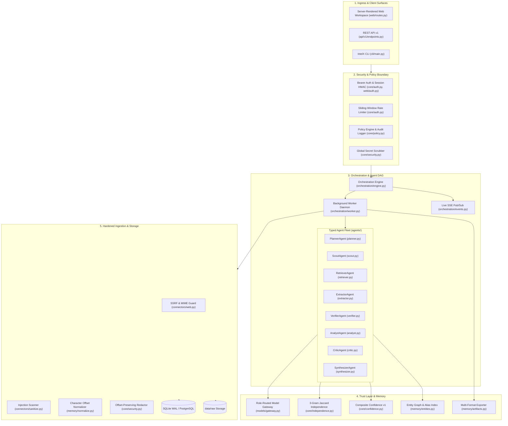
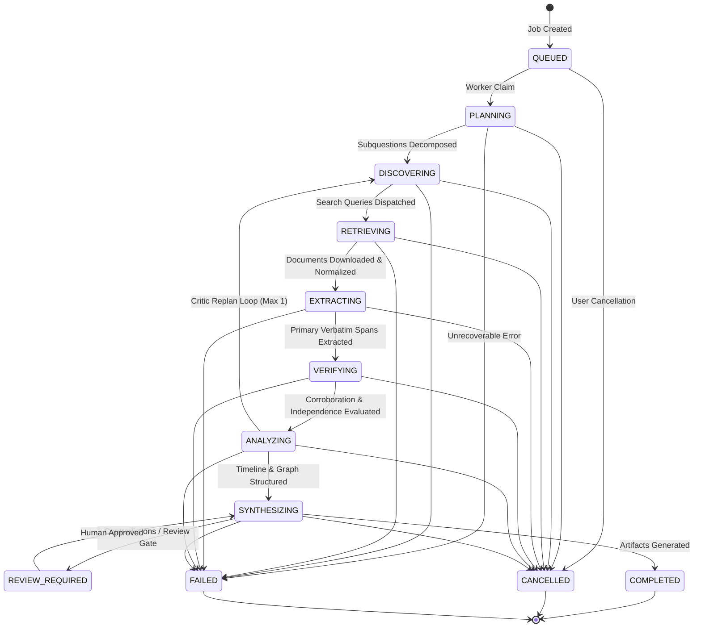

# INTELX System Architecture

This document describes the architectural layers, execution lifecycle, orchestration state machine, and module layout of the **INTELX** intelligence monolith.

---

## 1. Architectural Layers & Component Flow



---

## 2. Research Job State Machine

All investigations follow strict transition rules enforced in [`intelx/orchestration/engine.py`](file:///d:/IntelX/intelx/orchestration/engine.py). Any invalid state transition raises an `InvalidStateTransitionError`.



---

## 3. Module & Package Layout

```
intelx/
├── agents/             # Typed agent implementations with Pydantic contracts
│   ├── base.py         # Agent ABC and AgentRegistry
│   ├── planner.py      # Objective decomposition & strategy allocation
│   ├── scout.py        # Search query execution & candidate deduplication
│   ├── retriever.py    # Fetching & normalization coordinator
│   ├── extractor.py    # Verbatim span claim extraction
│   ├── verifier.py     # Independent corroboration & contradiction detection
│   ├── analyst.py      # Timeline derivation & entity relationship mapping
│   ├── critic.py       # Self-critique, replanning, and review gating
│   └── synthesizer.py  # Report generation & groundedness partition
├── api/v1/             # REST endpoints (15 operations) & OpenAPI schema
├── app/                # FastAPI application factory, lifespan, and middlewares
├── cli/                # Standalone console command line interface
├── connectors/         # External search, HTTP fetching, SSRF guards, injection scanner
├── core/               # Settings, auth, policy engine, errors, logging, security, retention
├── db/                 # Models (18 tables), async engine, sessionmaker, Alembic migrations, repos
├── memory/             # Normalization, entities, and atomic multi-format artifacts
├── models/             # Model gateway, cost meters, and provider adapters (Mock, OpenAI, Anthropic)
└── web/                # Server-rendered Jinja2 UI, static CSS/JS, and citation inspection drawer
```
