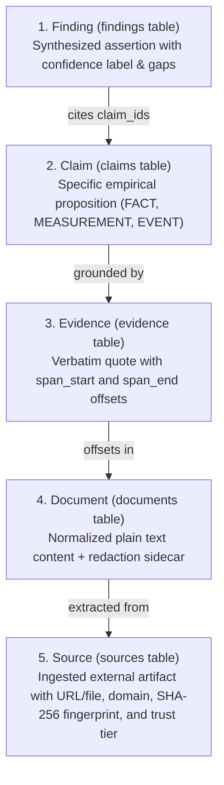
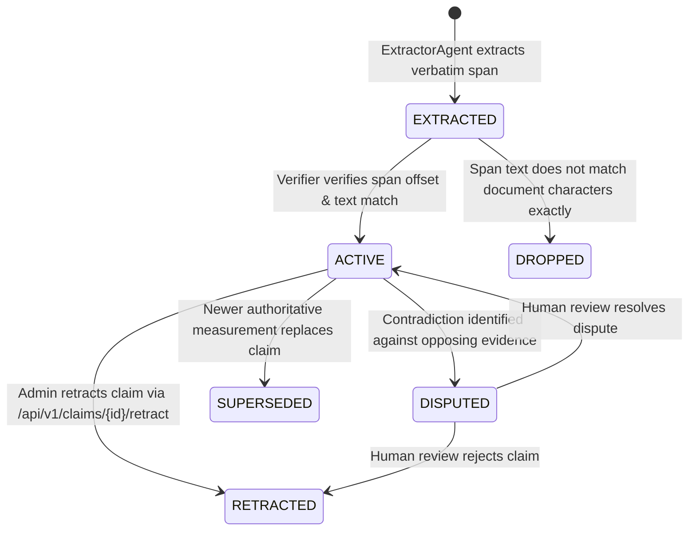

# INTELX Evidence Data Model & Provenance Chain

This document specifies the relational evidence schema, provenance invariants, entity lifecycles, and quarantine rules in **INTELX**.

---

## 1. The Evidence Provenance Chain

Every fact stated in an INTELX research report must resolve down a strict five-level immutable provenance chain:

---

## 2. Relational Schema Summary (18 Tables)

| Entity / Table | Primary Key | Description & Integrity Constraints |
|---|---|---|
| `research_runs` | `id` (UUID) | Research investigation record with status, outcome, and token/cost telemetry. |
| `tasks` | `id` (UUID) | Discrete DAG sub-step (`SCOUT`, `RETRIEVE`, `EXTRACT`, `VERIFY`, `ANALYZE`, `SYNTHESIZE`). |
| `sources` | `id` (UUID) | Ingested external resource with SHA-256 fingerprint, domain, and `TrustTier`. |
| `documents` | `id` (UUID) | Normalized plain text representation of an ingested source. |
| `chunks` | `id` (UUID) | Overlapping slice with verified `start_char` and `end_char` offsets. |
| `claims` | `id` (UUID) | Atomic extracted proposition with verbatim quote matching `document.text[span_start:span_end]`. |
| `evidence` | `id` (UUID) | Linked quote supporting or refuting a claim with 3-gram independence attributes. |
| `findings` | `id` (UUID) | Key takeaway linking $\ge 1$ supporting claim IDs to an executive answer statement. |
| `contradictions`| `id` (UUID) | Two opposing claims with disputed status and conflict rationale. |
| `entities` | `id` (UUID) | Canonical named entity (organization, technology, person, metric). |
| `entity_aliases`| `id` (UUID) | Alternative alias strings mapping to canonical entities. |
| `relationships` | `id` (UUID) | Directed relationship triplet (`source_entity`, `predicate`, `target_entity`). |
| `artifacts` | `id` (UUID) | Generated export file (`MD`, `JSON`, `EVIDENCE_PACK`, `SOURCES_CSV`) with SHA-256 hash. |
| `events` | `id` (Integer) | Streaming SSE progress event with monotonic ID. |
| `api_keys` | `id` (UUID) | SHA-256 digest of bearer keys, role tier (`ADMIN`, `MEMBER`), and rate limit windows. |
| `policies` | `id` (Integer) | Configured governance policy row evaluating domain lists and budget caps. |
| `review_decisions`| `id` (UUID)| Human reviewer determination (`APPROVED`, `REJECTED`) on paused jobs. |
| `audit_events` | `id` (Integer) | Tamper-evident append-only SHA-256 hash chained governance ledger. |

---

## 3. Trust Tiers & Quarantine Rules

Each source is assigned an initial `TrustTier` upon ingestion based on its origin and allowlist rules:

| Trust Tier | Definition & Behavioral Policy | Initial Allocation |
|---|---|---|
| `TRUSTED` | Authoritative primary repositories with verified integrity. Claims are prioritized. | Explicitly promoted by Admin or whitelisted domains. |
| `STANDARD` | Verified external domains and local uploaded files. Standard verification applies. | Local files (`SourceKind.FILE`) and domains on `DOMAIN_ALLOWLIST`. |
| `QUARANTINE` | Unverified external web domains. Maximum verdict capped at `UNCORROBORATED`. | Any web domain not present on `DOMAIN_ALLOWLIST`. |
| `BLOCKED` | Malicious or explicitly denylisted sources. Connector fetching is blocked. | Domains on `DOMAIN_DENYLIST` or explicitly blocked by Admin. |

---

## 4. Claim Lifecycle & Verbatim Span Enforcement

### The Verbatim Span Invariant
Whenever a claim is created in [`intelx/db/repos.py`](file:///d:/IntelX/intelx/db/repos.py#L380):
$$\text{document.text}[\text{span\_start} : \text{span\_end}] == \text{quote}$$
If the slice does not match the quote character-for-character, the transaction is rejected with an `IntegrityError`, ensuring zero hallucinated citations can enter the knowledge base.
