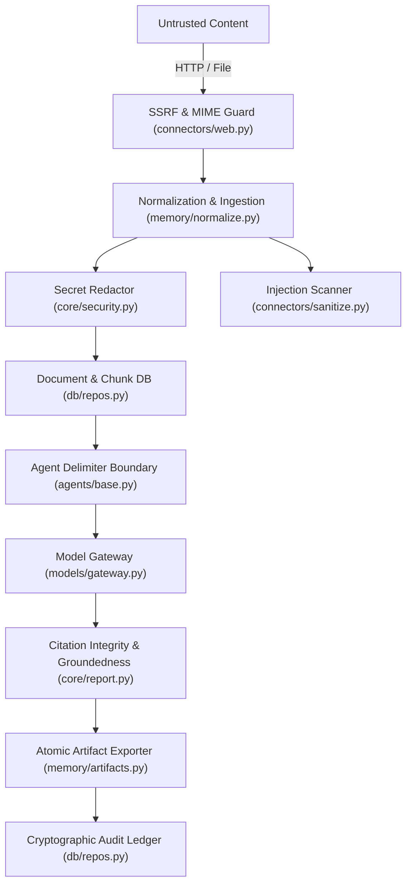

# INTELX Security Architecture & Threat Model (v1.0)

This document specifies the security boundary, threat agents, protected assets, mitigation controls, and residual risk assessments for the **INTELX** intelligence platform.

---

## 1. System Overview & Trust Assumptions

INTELX operates as a Python monolith that ingests untrusted external content (web pages, search results, uploaded documents) and synthesizes evidence-backed intelligence reports through role-routed LLMs.

### Core Security Tenet
> **Retrieved content is DATA, NEVER instructions.**
> External content is untrusted, immutable, and strictly quarantined from agent system instructions.

---

## 2. Attacker Profiles & Capabilities

| Threat Actor | Capabilities & Vector | Objective |
|---|---|---|
| **Malicious Web Host / Publisher** | Controls web page content, redirects, and HTTP responses retrieved by `HttpFetchConnector`. | Execute Server-Side Request Forgery (SSRF), poison primary corpus, exploit parser vulnerabilities. |
| **Adversarial Content Provider** | Embeds indirect prompt injections, Unicode homoglyphs, and delimiter breakout sequences in ingested documents. | Hijack downstream LLM agent behavior, override research objectives, leak system prompts. |
| **Curious / Malicious Insider** | Has API access with `MEMBER` or `ADMIN` role credentials. | Escalate privileges, access raw secret keys, tamper with audit history, exfiltrate primary data. |

---

## 3. Protected Assets

1. **System & Agent Instructions**: Prevent prompt overriding, jailbreaks, and instructions leak.
2. **Infrastructure & Internal Network**: Prevent internal port scanning, cloud metadata access (AWS/GCP/Azure IMDS), and SSRF.
3. **Evidence Graph & Report Integrity**: Guarantee that every cited finding traces to immutable, verbatim primary quotes.
4. **API Keys & Sensitive Credentials**: Prevent plaintext storage, logging, or transmission of secret keys.
5. **Governance Audit Ledger**: Append-only cryptographic ledger verifying that administrative actions cannot be repudiated.

---

## 4. Mitigation Controls & Code Mapping



### Control 1: SSRF & Redirect Defense
- **Implementation**: [`intelx/connectors/web.py`](file:///d:/IntelX/intelx/connectors/web.py)
- **Mechanisms**:
  - DNS resolution pre-flight checking before HTTP connection.
  - Strict blocking of private (`10.0.0.0/8`, `172.16.0.0/12`, `192.168.0.0/16`), loopback (`127.0.0.0/8`, `::1`), link-local (`169.254.0.0/16`), and AWS/Cloud metadata IP endpoints.
  - Per-redirect hop resolution re-evaluation (max 5 hops).
  - Body length caps (`MAX_RESPONSE_BYTES`) and disallowed MIME type early rejection.

### Control 2: Non-Mutating Injection Scanning & Quarantine
- **Implementation**: [`intelx/connectors/sanitize.py`](file:///d:/IntelX/intelx/connectors/sanitize.py)
- **Mechanisms**:
  - Multi-pattern regex and Unicode homoglyph normalizer scanning for role hijacking, system tags, and delimiter breakouts.
  - **Zero content mutation**: Content bytes remain verbatim to preserve exact character slice offsets.
  - Unverified web domains automatically assigned `TrustTier.QUARANTINE`.

### Control 3: Strict Agent Delimiter Sandboxing
- **Implementation**: [`intelx/agents/base.py`](file:///d:/IntelX/intelx/agents/base.py)
- **Mechanisms**:
  - System messages contain **ONLY** immutable instructions.
  - Retrieved documents are passed **ONLY** in user messages, enclosed inside strict delimiter boundaries:
    ```
    <<<EXTERNAL_DOCUMENT id=... source=...>>>
    [Document text]
    <<<END_EXTERNAL_DOCUMENT>>>
    ```

### Control 4: Character-Preserving Secret Redaction
- **Implementation**: [`intelx/core/security.py`](file:///d:/IntelX/intelx/core/security.py)
- **Mechanisms**:
  - Pre-storage scanning of normalized text for high-entropy secrets (API keys, bearer tokens, AWS keys).
  - Redaction replaces matched values with exact length-padded tokens (`[REDACTED:KEY]   `), preserving 100% of character offsets for citation verification.
  - Redactions stored in sidecar JSON files (`data/raw/<fingerprint>.redactions.json`).

### Control 5: Global Log Scrubber
- **Implementation**: [`intelx/core/security.py`](file:///d:/IntelX/intelx/core/security.py) & [`intelx/core/logging.py`](file:///d:/IntelX/intelx/core/logging.py)
- **Mechanisms**:
  - Root logger filter intercepts all records and redacts bearer tokens, API keys, and credential patterns before console or disk emission.

### Control 6: Machine-Enforced Citation Integrity
- **Implementation**: [`intelx/core/report.py`](file:///d:/IntelX/intelx/core/report.py)
- **Mechanisms**:
  - Validates that every citation token `[S:<id>]` and `[C:<id>]` resolves to a known entity.
  - Rejects unresolvable tokens with `IntegrityError`.
  - Enforces groundedness: key findings supported only by disputed claims are moved to an unverified observations appendix.

### Control 7: Tamper-Evident Cryptographic Audit Ledger
- **Implementation**: [`intelx/db/repos.py`](file:///d:/IntelX/intelx/db/repos.py#L420)
- **Mechanisms**:
  - Every governance action (review decision, policy denial, source trust update, claim retraction) is hashed with the previous record's SHA-256 digest:
    $$\text{hash}_n = \text{SHA256}(\text{hash}_{n-1} + \text{ts} + \text{actor} + \text{action} + \text{object\_id} + \text{detail})$$
  - `AuditChain.verify()` mathematically proves ledger integrity and detects any historical tampering.

---

## 5. Residual Risks & Future Mitigations

1. **DNS Rebinding Attacks (MVP Residual Risk)**:
   - *Current State*: DNS resolution is checked pre-flight before issuing requests, and redirect locations are resolved.
   - *Residual Risk*: In a fast-flux DNS rebinding scenario, a malicious DNS server could return a public IP during pre-flight and switch to an internal IP (127.0.0.1) on socket connection.
   - *Future Mitigation*: Enforce socket-level IP binding via a custom `httpx.AsyncHTTPTransport` network connection hook in v1.1.

2. **Model Hallucination on Zero-Evidence Runs**:
   - *Mitigation*: Validated by the `SynthesizerAgent` groundedness filter which forces run outcomes to `INSUFFICIENT_EVIDENCE` whenever primary claims are absent.

3. **Offline Scope Enforcement**:
   - *Mitigation*: Full offline operation verified via `MockProvider` and local file connector fixtures without external network calls.
